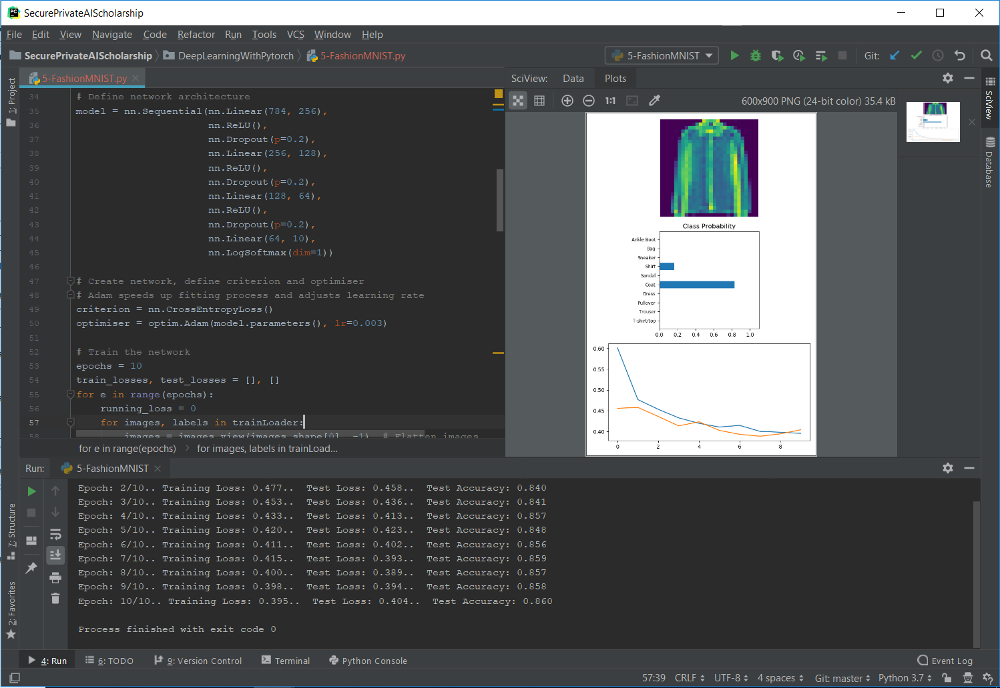

# Secure Private AI Scholarship
This repository contains python scripts for Machine Learning, learned during my time participating in the <a href="https://eu.udacity.com/facebook-AI-scholarship"><b>Secure and Private AI Facebook Scholarship Challenge</b></a> by Udacity. 
In the repository are the basics of deep learning with PyTorch and some of my completed projects. 
All of these are my personal notes and exercises for learning, made accessible to my classmates in case they needed help for a solution.

## Motivation
This project exists so I can track my progress on the course, showcase what I've been learning, and also save my work as a reference in the future, in case I need a refresher on anything I had learned.

## Screenshot

## Features
- [ ] — <b>not uploaded</b>
- [x] — <b>uploaded</b>

#### Deep Learning with PyTorch:
  - [x] Basics of Neural Networks
  - [x] Training a Network
  - [x] MNIST Example
  - [x] Saving/Loading Models
  - [ ] Maths Basics
  
#### Differential Privacy:
  - [ ] Differential Privacy (DP)
  - [ ] DP with Deep Learning
  - [ ] Local and Global DP
  
#### Federated Learning:
  - [ ] Remote Tensors
  - [ ] Toy Federated Learning
  - [ ] Secret Sharing

#### Encrypted Deep Learning:
  - [ ] Encrypted Computation
  - [ ] Encrypted Database
  - [ ] Encrypted Deep Learning in PyTorch

## Tech/Framework Used
<b>Built with:</b>
- <a href="https://pytorch.org/">PyTorch</a>
- <a href="https://numpy.org/">Numpy</a>
- <a href="https://matplotlib.org/">Matplotlib</a>
- <a href="https://github.com/OpenMined/PySyft">PySyft</a>

## Notes
I have tried to make sure these are concise and in order. If you have any questions, please message me on here or on slack.
